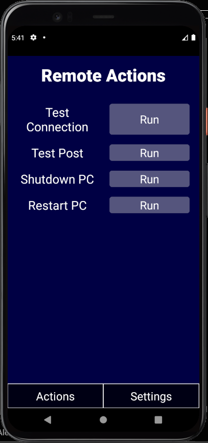

# RemoteActions

A basic React Native app frontend with a basic .NetCore API backend that runs actions with the tap of a single button.

---
## Limitations (These will be updated and removed from list once completed):
- Project is setup only for a single hardcoded ip
- Only works while on the same local network as server
- **Nonexistant security** for 'bad actors' to randomly shutdown the server (reason why it is currently only local network)

---
## To-Do:
- ~~Add ActivityIndicator while waiting for requests~~
- Add more actions
- Add login features to the settings page
- Add ability to change request address
- Add ability to enter password
- Passowrd saved so not needed to enter every time app opened
- Add Test connection to settings - with password check
- Add proper security to allow app to run actions over internet
- Allow app to work over internet

- Update mobile UI to look more professional

